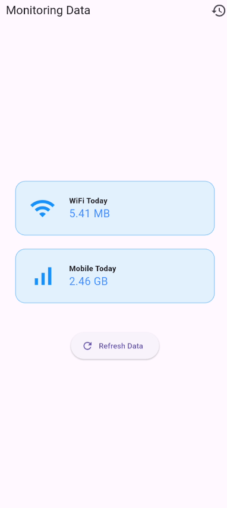
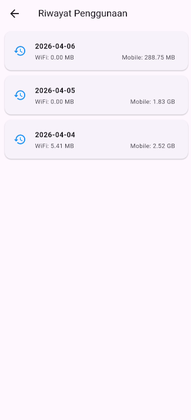

# Data Usage Limit
Brief description:  
Data Usage Limit is a bandwidth monitoring app for Android devices. The app retrieves daily data usage statistics from the system (including both mobile data via SIM and Wi-Fi connections), stores usage summaries in SQLite, and displays usage history and current usage status.


| Home Page | Detail Page |
| :------------: | :-----------: |
|  |  |


Main features:
- Monitor daily data usage for Wi-Fi and mobile networks.
- Save daily usage history for simple analysis.
- Provide an interface to view history and manually refresh data.

Installation steps (for developers):
1. Ensure the Flutter environment is installed and `flutter` is in your PATH.
2. Clone the repository to your local machine:

```bash
git clone <repo-url>
cd limit_kuota
```

3. Install dependencies:

```bash
flutter pub get
```

4. Running analyzer and test:

```bash
flutter analyze
flutter test
```

5. Running the app on an Android emulator or device:

```bash
flutter run
```

6. When moving files or restructuring, use `git mv` to preserve the commit history.

Planned features (priority):
1) Automatic data limit enforcement — if total usage exceeds the user-defined limit, block data access (or redirect the user to settings to disconnect). Note: Full blocking functionality may require special system permissions or platform-level implementation (Kotlin/Android).
2) Notifications (push/local) when usage approaches or reaches the specified limit.
3) Login/account features — synchronization of preferences and per-user quota limits

Additional feature suggestions:
- Usage visualization (daily/weekly/monthly).
- Data-saving mode: recommended settings to reduce background usage.
- Export/import history (CSV) for external analysis.
- Customizable notification thresholds per network (Wi-Fi vs. Mobile).

Technical notes & limitations:
- The app currently reads data from MethodChannel (`getTodayUsage`) — the platform logic (Kotlin) needs to be reviewed regarding data usage permissions.
- Automatically disconnecting the data connection is generally not permitted without system permissions or device admin status; a possible solution is to open the relevant settings page or provide guidance to the user.
